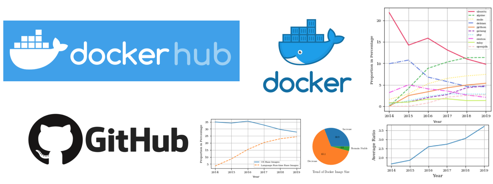

# A Large-scale Empirical Study on Docker Images Hosted on Docker Hub
This is the artifact repository for describing the data set collected and reproducing all research questions in the paper.

## Description of the Data set
We collect a data set from both GitHub and Docker Hub, consisting of 1,714,947 Docker images and the corresponding Dockerfiles of 278,502 of those images. The data set is available on figshare through [the link](https://figshare.com/s/020a0c6e1b5570a32e73).
The data set has 34 attributes. The description, type, data source, and example of each attribute are listed in the following table.

| Field Name                | Description                                                                         | Type             | Data Source         | Example                                                                                  |
|---------------------------|-------------------------------------------------------------------------------------|------------------|---------------------|------------------------------------------------------------------------------------------|
| image_name                | The name of the Docker image                                                        | String           | Docker Hub          | user/myimage                                                                             |
| source_repo_name          | The name of the source repo on GitHub                                               | String           | Docker Hub          | user/myrepo                                                                              |
| latest_dockerfile         | The latest Dockerfile of the Docker image                                           | String           | Docker Hub / GitHub | FROM python:3.6\nRUN pip install -r requirements.txt\nCMD ["python", "/app.py"]\n        |
| tags_count                | The total number of Docker image tags                                               | Integer          | Docker Hub          | 16                                                                                       |
| tags_name                 | The list of all tags of the Docker image                                            | Stringified List | Docker Hub          | ['v0.0.1', 'v0.0.0', 'latest', 'a341b644d63a2154c5abf9da96155273938ffc0c']               |
| image_size                | The list of the Docker image size for each tag in bytes                             | Stringified List | Docker Hub          | [48001683, 48323559]                                                                     |
| image_updated_at          | The list of the Docker image update timestamps for each tag                         | Stringified List | Docker Hub          | ['2019-02-14 09:57:18', '2019-05-12 12:32:16']                                           |
| image_pull_count          | The pull count of the Docker image                                                  | Integer          | Docker Hub          | 6284                                                                                     |
| image_star_count          | The star count of the Docker image                                                  | Integer          | Docker Hub          | 4                                                                                        |
| image_description         | The description of the Docker image                                                 | String           | Docker Hub          | Simple spark 2.2.0 standalone with a few more libraries                                  |
| repo_commits_count        | The commit count of the source repo                                                 | Integer          | GitHub              | 87                                                                                       |
| dockerfile_commit_sha     | The list of SHA of each commit involving Dockerfile in the source repo              | Stringified List | GitHub              | ['0f9aaab85fd2e6b3a68bfa38012d3fe8f2244ce4', '1d4cd0e980f82659ce0b51f8dafd2f1d333d1223'] |
| dockerfile_commit_date    | The list of timestamps of each commit involving Dockerfile in the source repo       | Stringified List | GitHub              | ['2018-10-30 15:34:28', '2019-02-13 15:05:50']                                           |
| dockerfile_commit_message | The list of messages of each commit involving Dockerfile in the source repo         | Stringified List | GitHub              | ['cloud object storage', 'pass GITHUB_TOKEN to docker build']                            |
| language                  | The predominant programming language of the source repo                             | String           | GitHub              | Shell                                                                                    |
| forks_count               | The fork count of the source repo                                                   | Integer          | GitHub              | 0                                                                                        |
| stargazers_count          | The star count of the source repo                                                   | Integer          | GitHub              | 2                                                                                        |
| watchers_count            | The watcher count of the source repo                                                | Integer          | GitHub              | 4                                                                                        |
| repo_size                 | The size of the source repo  in kilobytes                                           | Integer          | GitHub              | 3853                                                                                     |
| default_branch            | The default branch of the source repo                                               | String           | GitHub              | master                                                                                   |
| open_issues_count         | The open issue count of the source repo                                             | Integer          | GitHub              | 1                                                                                        |
| has_issues                | True: The source repo enables issues / False: The source disables issues            | Boolean          | GitHub              | false                                                                                    |
| has_projects              | True: The source repo enables projects / False: The source repo disables projects   | Boolean          | GitHub              | false                                                                                    |
| has_wiki                  | True: The source repo enables the wiki / False: The source repo disables the wiki   | Boolean          | GitHub              | true                                                                                     |
| has_pages                 | True: The source repo enables pages / False: The source repo disables pages         | Boolean          | GitHub              | true                                                                                     |
| has_downloads             | True: The source repo enables downloads / False: The source repo disables downloads | Boolean          | GitHub              | false                                                                                    |
| archived                  | True: The source repo has been archived / False: The source repo is not archived    | Boolean          | GitHub              | false                                                                                    |
| pushed_at                 | The timestamp of the latest push in the source repo                                 | String           | GitHub              | 2019-05-24 07:05:08                                                                      |
| created_at                | The timestamp of the source repo creation                                           | String           | GitHub              | 2019-02-14 16:27:46                                                                      |
| updated_at                | The timestamp of the latest update in the source repo                               | String           | GitHub              | 2019-05-11 08:47:50                                                                      |
| subscribers_count         | The subscriber count of the source repo                                             | Integer          | GitHub              | 3                                                                                        |
| network_count             | The network count of the source repo                                                | Integer          | GitHub              | 0                                                                                        |
| license                   | The license of the source repo                                                      | String           | GitHub              | apache-2.0                                                                               |
| collection_method         | The data collection method: GitHubCI / BitbucketCI / NameMatch / NA                 | String           | N/A                 | GitHubCI                                                                                 |

We collected Dockerfiles of 278,502 of those images. The latest_dockerfile field would be empty for images without using auto builds or does not have a name matched repository on GitHub. 

The collection_method attribute is used to label the way we collected the Dockerfile. The possible values of this field are (1) DockerHubCI, which indicates the image is using the CI for auto builds and has its source repository hosted on the GitHub. We collected Dockerfiles and other repository information such as language, repo size, and repo update time for these images. (2) BitbucketCI, which indicates the image is using the CI for auto builds and has its source repository hosted on the Bitbucket. We only collected Dockerfiles of these images and ignored other repository information. (3) NameMatch, which indicates that the image is not using the CI for auto builds, but we find a GitHub repository
with a name that is the same as the Docker image name. We collected Dockerfiles and other repository information for these images. (4) NA, which indicates that the image is not using the CI for auto builds, and we can not match a repository on GitHub by its image name. For these images, only the image information obtained from Docker Hub is available.

More information about the data set including the shape and the distribution of pull count can be found in the [Jupyter Notebook](./RQs/RQ0/RQ0.ipynb).

## Research questions
For each RQ, there is a Jupyter Notebook in the corresponding folder for reproducing all numbers, figures, and results in the paper. All scripts are written in Python.

Before running scripts of each RQ, the data set `docker_image_dataset.csv` should be downloaded from [the link](https://figshare.com/s/020a0c6e1b5570a32e73) and put into `./RQs/data/`. All required packages specified in `./RQs/requirements.txt` should be installed through the command `pip3 install -r ./RQs/requirements.txt`.

For [RQ6](./RQs/RQ6/RQ6.ipynb), Haskell Dockerfile Linter must be installed to reproduce the analysis of Dockerfiles, and the installation guide can be found in [RQ6.md](./RQs/RQ6/RQ6.md). For ease of reproduction, we have dumped the base image extraction results in RQ2 and smell analysis results in RQ6 into CSV files, since these procedures may take hours to run. The data dumps (`RQ2_base_images.csv`, `RQ6_SAT_result.csv`, `RQ6_prevalent_code_smell.csv`, and `RQ6_code_smell_trend.csv`) can be downloaded from [the link](https://figshare.com/s/020a0c6e1b5570a32e73) and be directly loaded in the Jupyter notebooks of RQ2 and RQ3 by putting them into `./RQs/data/`. Scripts for reproducing the base image extraction, smell detection, and dumping data are still included in the Jupyter Notebook.

Here are links to the Jupyter Notebook of each RQ.

[RQ1: What are the popular programming languages used by the source files in Docker images?](./RQs/RQ1/RQ1.ipynb)

[RQ2: What are the popular base images?](./RQs/RQ2/RQ2.ipynb)

[RQ3: How does the size of Docker images evolve?](./RQs/RQ3/RQ3.ipynb)

[RQ4: Are there smells in Docker image tags?](./RQs/RQ4/RQ4.ipynb)

[RQ5: How do Dockerfiles co-evolve with other source code?](./RQs/RQ5/RQ5.ipynb)

[RQ6: How prevalent are code smells in Dockerfiles?](./RQs/RQ6/RQ6.ipynb)

## Crawler
The crawler contains two Docker images and one web application. We developed two containerized crawlers, namely docker-image-name-crawler and docker-image-crawler, responsible for collecting the name of public Docker images on Docker Hub from Docker Hub search engine, and collecting image information from Docker Hub and obtaining repository information from GitHub respectively. We also developed a Django-based web application to dispatch tasks to and retrieve data from crawler containers. The steps to reproduce the crawler are as follows.

1. Follwing the [steps](https://www.postgresql.org/download/linux/ubuntu/) to install and configure PostgreSQL
2. Create a database named `docker_dataset` in PostgreSQL server
3. Configure the database connection settings in `./crawler/webapp/webapp/webapp/settings.py`
4. Install all required packages specified in `./crawler/webapp/requirements.txt`
5. `cd ./crawler/webapp/webapp`
6. `python3 manage.py makemigrations dockerstudy`
7. `python3 migrate.py migrate`
8. `python3 db_init.py`
9. `gunicorn --workers=8 --bind 0.0.0.0:8000 webapp.wsgi` and the website should be running on ip:8000
10. Build the Docker images
11. Use `docker run -d -e "POSTURL=http://your-ip:8000" --restart always your-docker-image-name` to create a crawler container and crawl the desired information
12. Data crawled can be viewed in the web application through `http://your-ip:8000/admin`. The default user name is `admin`, password is `pass`.

Note: In a recent update, the Docker Hub no longer allows its [search engine](https://hub.docker.com/search/?q=&type=image) to list all images hosted on it. Now, the search engine can only return at most 2,500 images, which are the most recently updated. As the Docker image name crawler utilizes the Docker Hub search engine, this crawler may not be reproducible for collecting the name of all public Docker images hosted on Docker Hub. 
